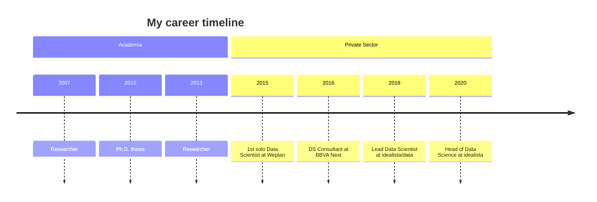

> [!warning]
> This note is subject to frequent changes!

A page to test markdown renderings in Quartz.

---

<!-- This page is the same as https://github.com/metruzanca/metruzanca -->

# Sam anca

Hey there, I'm Sam, a seasoned Full-Stack Developer driven by a passion for creating user-friendly digital experiences. Since I tinkered with my first line of code at 14, I've been all about keeping things simple in software. I love making the web more accessible and flexible, shaping both smooth User Experiences and hassle-free Developer Experiences.

For me, it's all about learning and sharing what I pick up along the way. I aim to be a reliable source of expertise and experience for my team. I'm driven by the desire to empower teammates, fostering an environment where everyone thrives. My eyes are set on leading a team in the near future, eager to guide and cultivate a collaborative, innovative atmosphere.
<!-- Color Palette:
  875cff: Purple-ish Blue
  f7e13a: Yellow
-->

<!-- https://github.com/DenverCoder1/custom-icon-badges -->

[](mailto:samuele+blog@zanca.dev)
[](https://www.google.com/maps/place/Jersey+City,+NJ)
[](https://solid-resume.vercel.app/metruzanca)
[](https://cal.com/samzanca/15min)

---

### 🛠️ Languages and Tools

<!-- https://devicon.dev/ -->


<!-- Note, the last icon needs to have no alignment set -->

---


---


---

[[tags/docker|]]
[[tags/github|]]
[[tags/latex|]]
[[tags/markdown|]]

---

[](tags/docker)
[](tags/github)
[](tags/latex)
[](tags/markdown)

---

[](tags/docker)
[](tags/github)
[](tags/latex)
[](tags/markdown)

---

- ⚛ [[Physics]] 1
   - [[]]
- 🐳 [[Selfhosted]]  
[](tags/docker)
[](tags/github)
[](tags/latex)
[](tags/markdown)
A hobby of mine is home brewing which I like for its combination of traditional techniques, modern experiments, its fusion of handcrafting and automation - and of course it provides you with tasty beer ;)  
Documenting my suds (brewing processes, "Sud" in german) was a big motivation for creating this blog, besides my [[Selfhosted/]] hobby.  
In this category I also deal with other food-related topics, like brewing mead, fermenting kombucha, baking bread and general cooking recipes.
- ⚛ [[Physics]]
   - [[]]

---

- ⚛ [[Physics]]
   - [[]]
- 🐳 [[Selfhosted]]  
[](tags/docker)
[](tags/github)
[](tags/latex)
[](tags/markdown)  
	A hobby of mine is home brewing which I like for its combination of traditional techniques, modern experiments, its fusion of handcrafting and automation - and of course it provides you with tasty beer ;)  
Documenting my suds (brewing processes, "Sud" in german) was a big motivation for creating this blog, besides my [[Selfhosted/]] hobby.  
In this category I also deal with other food-related topics, like brewing mead, fermenting kombucha, baking bread and general cooking recipes.
- ⚛ [[Physics]]
   - [[]]

---

<br>

_For side projects, my goto stack has been: Solid, Tailwind and I'm currently trying out Turso._

<br>

### 🧠 Development Philosophies

- [Software Craftsmanship](https://manifesto.softwarecraftsmanship.org/)
- [Simplicity, Please](https://www.infoq.com/articles/simplicity-manifesto-development/)
- [Agile](https://agilemanifesto.org/)


<br>


### 💻 Operating Systems

I'm an avid user of all 3 main operating systems. Theres no best OS, they all have their pros and cons. Linux wise, I'm currently back on ubuntu for simplicity sake, but I've previously used Arch for a full 2 years and breifly experimented with NixOs.


<br>

### ✒️ Blog
I’ve been wanting to write more blog posts about what I’m learning. Its 2024, its time to get writing! [Recent Posts](https://zanca.dev/blog/)

---

### 🎧 Music

I listen to a lot of music, heres what I'm currently listening to.

(_It's probably Metal or Synthwave_)

<!-- https://github.com/kittinan/spotify-github-profile -->

[](https://spotify-github-profile.vercel.app/api/view?uid=metruzanca&redirect=true)

_All my music listening is recorded on [last.fm](https://www.last.fm/user/metruzanca)._

<!-- https://github.com/anuraghazra/github-readme-stats -->
<!--  -->


<!--  -->


---

---


Proxmox
Tailscale
TrueNAS
HomeAssistant

Fedora: 
Anaconda: 
Ansible: 
Bash: 
GitHub: 
GitLab: 
Grafana: 
InfluxDB: 
Jupyter: 
K3S: 
Kubernetes: 
LaTEX: 
Markdown: 
Podman: 
Portainer: 
Prometheus: 
Python: 
Rancher: 
Raspberry: 
Terraform: 
Traefik: 
VSCode: 


---

[](tags/docker)
[](tags/github)
[](tags/latex)
[](tags/markdown)
[](tags/windows)
[](tags/fedora)
[](tags/ansible)
[](tags/bash)
[](tags/gitlab)
[](tags/grafana)
[](tags/influxdb)
[](tags/jupyter)
[](tags/k3s)
[](tags/k8s)
[](tags/podman)
[](tags/portainer)
[](tags/prometheus)
[](tags/python)
[](tags/rancher)
[](tags/raspi)
[](tags/terraform)
[](tags/traefik)
[](tags/vscode)


12:

[](tags/linux)
[](tags/git)

---

<iframe width="560" height="315" src="[https://www.youtube-nocookie.com/embed/videoseries?list=PLveghVPT3X7bzbViFXOMNKP5IQqLDzr1f](https://www.youtube-nocookie.com/embed/videoseries?list=PLveghVPT3X7bzbViFXOMNKP5IQqLDzr1f)" title="YouTube video player" frameborder="0" allow="accelerometer; autoplay; clipboard-write; encrypted-media; gyroscope; picture-in-picture; web-share" allowfullscreen></iframe>

>[!example] Subreddits
>
>- [r/blenderhelp](https://www.reddit.com/r/blenderhelp/)
>- [r/Blender](https://www.reddit.com/r/blender/)
>- [r/3Dmodeling](https://www.reddit.com/r/3Dmodeling/)
>- [r/ZBrush](https://www.reddit.com/r/ZBrush/)
>- [r/MarmosetToolbag](https://www.reddit.com/r/MarmosetToolbag/)
>- [r/conceptart](https://www.reddit.com/r/conceptart/)
>- [r/unrealengine](https://www.reddit.com/r/unrealengine/)

---

-> https://forum.obsidian.md/t/how-to-make-dataview-works-in-table/20445

| Col 1                | Col 2              |
| -------------------- | ------------------ |
| `=this.file.inlinks` | `=this.file.ctime` |

---

> [!abstract]- Sciujo
> The [[Sciujo]] ("knowledge container" in Esperanto) is the main and the knowledge-oriented part of the Notkesto; it follows the [[Zettelkasten]] method.

---

<iframe width="560" height="315" src="https://www.youtube-nocookie.com/embed/videoseries?list=PLveghVPT3X7bzbViFXOMNKP5IQqLDzr1f" title="YouTube video player" frameborder="0" allow="accelerometer; autoplay; clipboard-write; encrypted-media; gyroscope; picture-in-picture; web-share" allowfullscreen></iframe>

<iframe width="560" height="315" src="https://www.youtube-nocookie.com/embed/videoseries?list=PLveghVPT3X7bzbViFXOMNKP5IQqLDzr1f" title="YouTube video player" allowfullscreen></iframe>

---

![[giphy.gif]]

![[punpun1.gif]]

[[alias2]]

---

<div style="text-align: right"> your-text-here, right </div>

<p style='text-align: justify;'> Here I describe the setup I came up with in order to use multiple jDownloader2 instances in parallel on the same machine. With it you can bypass the by many [One-click hosters](https://en.wikipedia.org/wiki/File-hosting_service#One-click_hosting) enforced limit that prevents multiple simultaneous downloads (or enforces a waiting period between downloads). </p>

<p style='text-align: right;'> Your Text, right </p>

---

<!-- Snek -->   
<p align="center">
<a href="https://gitstar-ranking.com/Lissy93" title="Snek 🐍"></a>
</p>

---



---

```poetry
- jacky :)
```

---

>[!code]- List markdown files from smallest to biggest
> Usually bigger file means more content, while smaller file means can be merged or removed
> ```python
> import os
>
> def get_markdown_files(directory):
> """Recursively finds all Markdown files in a directory and its subdirectories.
>
> Args:
> directory: The path to the directory to search.
>
> Returns:
> A list of tuples, where each tuple contains:
> * The filename (str)
> * The file size in bytes (int)
> """
>
> markdown_files = []
> for root, dirs, files in os.walk(directory):
> if 'Omnivore' in dirs:
> dirs.remove('Omnivore')
> for filename in files:
> if filename.endswith('.md') and not filename.endswith('excalidraw.md'):
> filepath = os.path.join(root, filename)
> filesize = os.path.getsize(filepath)
> markdown_files.append((filename, filesize))
> return markdown_files
>
> def main():
> current_directory = os.getcwd() # Get the current working directory
> files = get_markdown_files(current_directory)
>
> # Sort files by size (ascending)
> files.sort(key=lambda item: item[1])
>
> # Print the results
> for filename, filesize in files:
> print(f"{filename:<40} {filesize} bytes")
>
> if __name__ == "__main__":
> main()
> ```


---

-> https://www.pmcf.xyz/topo-da-mente/#you-open-the-gate

-> https://github.com/freenandes/topo-da-mente/blob/main/content/index.md

---

<div class="onecompilerCode-wrapper">
<iframe
 class="onecompilerCode"
 frameBorder="0" src="https://en.wikipedia.org/wiki/Package_manager#Comparison_of_commands" 
 ></iframe>
 </div>

---

<iframe
  src="https://codepen.io/team/codepen/embed/preview/PNaGbb"
  style="width:100%; height:300px;"
></iframe>

---

<iframe
  src="https://en.wikipedia.org/wiki/Package_manager#Comparison_of_commands"
  style="width:100%; height:600px;"
></iframe>

---

>[!code] Install package from `package-name.pkg.tar.xz`
> ```bash
> sudo pacman -U package-name.pkg.tar.xz
> ```

---

>[!code] Package Management
> List all the installed packages: `brew list` 
> 
> Check for outdated package: `brew outdated`
> 
> Upgrade all packages: `brew upgrade`
> 
> Check for deprecated packages: `brew doctor`

>[!code] Package Management
> List all the installed packages: `brew list` 
> Check for outdated package: `brew outdated`
> Upgrade all packages: `brew upgrade`
> Check for deprecated packages: `brew doctor`

>[!info]- Brew Formula
> Simple Ruby scripts, we can easily revert our modifications and merge upstream updates with `brew edit <PACKAGE_NAME>`.

---

**Application-level**
- Set it with the corresponding SDK of the language used to code the app

>[!bigbrain] System-level vs Process-level
> ![[change_timezone.png|400]]
> 
> As you can see changing timezone on a process level doesn't affect the system-level timezone. And all processes follow the system-level timezone by default.

---

![[Pasted image 20240518184453.png]]


---

```diff  
diff --git a/file.txt b/file.txt  
index 62c73f1..ef5b7f9 100644  
--- a/file.txt  
+++ b/file.txt  
@@ -1,+4 +4 @@  
-Hello, world!  
+Hello, Markdown!  
This is a sample file.  
-It's in plain text format.  
+It's in Markdown format.  
```

`$ git diff HEAD~1 HEAD file.txt`

`$ diff -u file1.txt file2.txt`