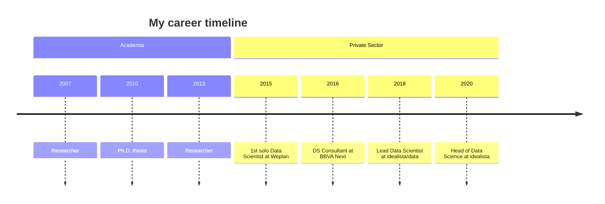

 
markdown content :)

![[giphy.gif]]

![[punpun1.gif]]

[[alias2]]

---

<div style="text-align: right"> your-text-here, right </div>

<p style='text-align: justify;'> Here I describe the setup I came up with in order to use multiple jDownloader2 instances in parallel on the same machine. With it you can bypass the by many [One-click hosters](https://en.wikipedia.org/wiki/File-hosting_service#One-click_hosting) enforced limit that prevents multiple simultaneous downloads (or enforces a waiting period between downloads). </p>

<p style='text-align: right;'> Your Text, right </p>

---

<!-- Snek -->   
<p align="center">
<a href="https://gitstar-ranking.com/Lissy93" title="Snek 🐍"></a>
</p>

---



---

```poetry
- jacky :)
```

---

>[!code]- List markdown files from smallest to biggest
> Usually bigger file means more content, while smaller file means can be merged or removed
> ```python
> import os
>
> def get_markdown_files(directory):
> """Recursively finds all Markdown files in a directory and its subdirectories.
>
> Args:
> directory: The path to the directory to search.
>
> Returns:
> A list of tuples, where each tuple contains:
> * The filename (str)
> * The file size in bytes (int)
> """
>
> markdown_files = []
> for root, dirs, files in os.walk(directory):
> if 'Omnivore' in dirs:
> dirs.remove('Omnivore')
> for filename in files:
> if filename.endswith('.md') and not filename.endswith('excalidraw.md'):
> filepath = os.path.join(root, filename)
> filesize = os.path.getsize(filepath)
> markdown_files.append((filename, filesize))
> return markdown_files
>
> def main():
> current_directory = os.getcwd() # Get the current working directory
> files = get_markdown_files(current_directory)
>
> # Sort files by size (ascending)
> files.sort(key=lambda item: item[1])
>
> # Print the results
> for filename, filesize in files:
> print(f"{filename:<40} {filesize} bytes")
>
> if __name__ == "__main__":
> main()
> ```


---

-> https://www.pmcf.xyz/topo-da-mente/#you-open-the-gate

-> https://github.com/freenandes/topo-da-mente/blob/main/content/index.md

---

<div class="onecompilerCode-wrapper">
<iframe
 class="onecompilerCode"
 frameBorder="0" src="https://en.wikipedia.org/wiki/Package_manager#Comparison_of_commands" 
 ></iframe>
 </div>

---

<iframe
  src="https://codepen.io/team/codepen/embed/preview/PNaGbb"
  style="width:100%; height:300px;"
></iframe>

---

<iframe
  src="https://en.wikipedia.org/wiki/Package_manager#Comparison_of_commands"
  style="width:100%; height:600px;"
></iframe>

---

>[!code] Install package from `package-name.pkg.tar.xz`
> ```bash
> sudo pacman -U package-name.pkg.tar.xz
> ```

---

>[!code] Package Management
> List all the installed packages: `brew list` 
> 
> Check for outdated package: `brew outdated`
> 
> Upgrade all packages: `brew upgrade`
> 
> Check for deprecated packages: `brew doctor`

>[!code] Package Management
> List all the installed packages: `brew list` 
> Check for outdated package: `brew outdated`
> Upgrade all packages: `brew upgrade`
> Check for deprecated packages: `brew doctor`

>[!info]- Brew Formula
> Simple Ruby scripts, we can easily revert our modifications and merge upstream updates with `brew edit <PACKAGE_NAME>`.

---

**Application-level**
- Set it with the corresponding SDK of the language used to code the app

>[!bigbrain] System-level vs Process-level
> ![[change_timezone.png|400]]
> 
> As you can see changing timezone on a process level doesn't affect the system-level timezone. And all processes follow the system-level timezone by default.

---

![[Pasted image 20240518184453.png]]


---

```diff  
diff --git a/file.txt b/file.txt  
index 62c73f1..ef5b7f9 100644  
--- a/file.txt  
+++ b/file.txt  
@@ -1,+4 +4 @@  
-Hello, world!  
+Hello, Markdown!  
This is a sample file.  
-It's in plain text format.  
+It's in Markdown format.  
```

`$ git diff HEAD~1 HEAD file.txt`

`$ diff -u file1.txt file2.txt`