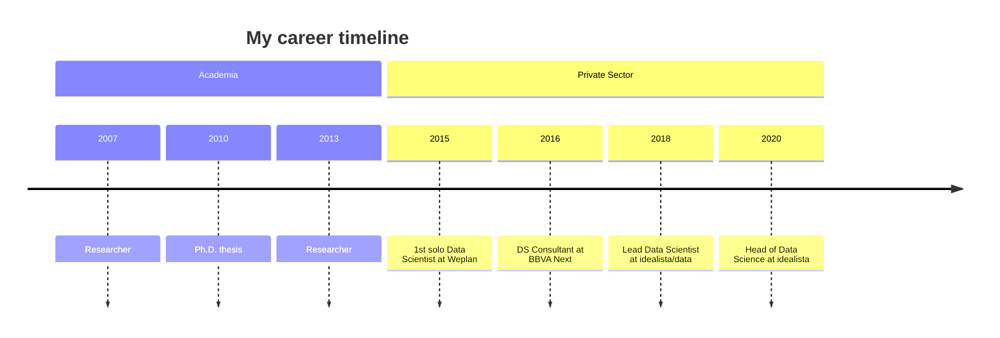

 
markdown content :)

![[giphy.gif]]

<!-- Snek -->   
<p align="center">
<a href="https://gitstar-ranking.com/Lissy93" title="Snek 🐍"></a>
</p>

---



---

>[!code]- List markdown files from smallest to biggest

> Usually bigger file means more content, while smaller file means can be merged or removed

> ```python

> import os

>

> def get_markdown_files(directory):

> """Recursively finds all Markdown files in a directory and its subdirectories.

>

> Args:

> directory: The path to the directory to search.

>

> Returns:

> A list of tuples, where each tuple contains:

> * The filename (str)

> * The file size in bytes (int)

> """

>

> markdown_files = []

> for root, dirs, files in os.walk(directory):

> if 'Omnivore' in dirs:

> dirs.remove('Omnivore')

> for filename in files:

> if filename.endswith('.md') and not filename.endswith('excalidraw.md'):

> filepath = os.path.join(root, filename)

> filesize = os.path.getsize(filepath)

> markdown_files.append((filename, filesize))

> return markdown_files

>

> def main():

> current_directory = os.getcwd() # Get the current working directory

> files = get_markdown_files(current_directory)

>

> # Sort files by size (ascending)

> files.sort(key=lambda item: item[1])

>

> # Print the results

> for filename, filesize in files:

> print(f"{filename:<40} {filesize} bytes")

>

> if __name__ == "__main__":

> main()

> ```